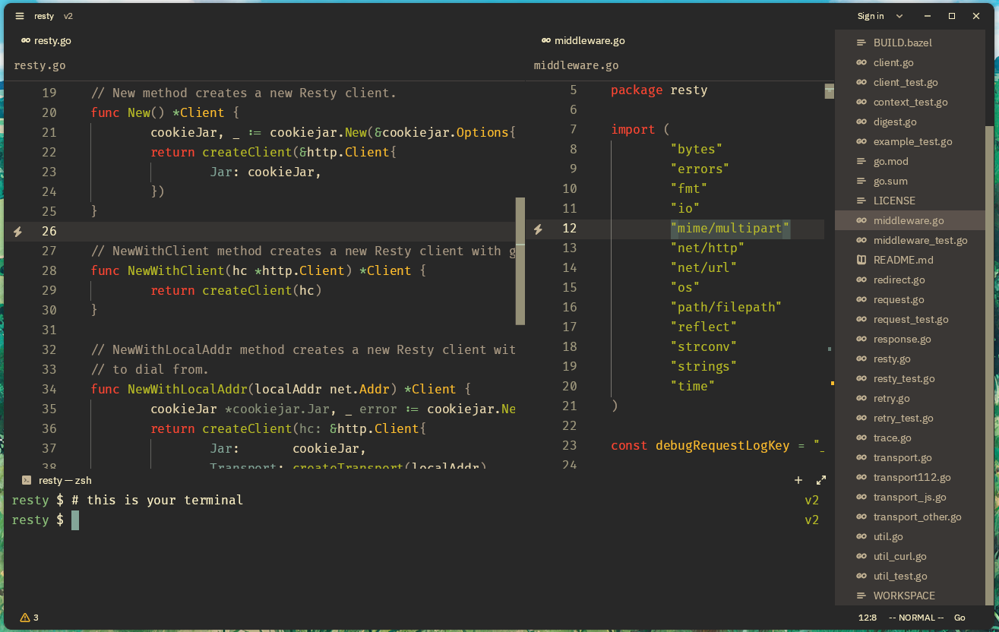

<div align="center">

# Settings for Zed editor

My settings for Zed Editor.



</div>

## Installation

1. Clone this repository.

2. Make a backup of your settings:

```shell
cp ~/.config/zed/settings.json ~/.config/zed/settings_backup.json
```

3. Copy `settings.json` to the Zed directory:

```shell
cp settings.json ~/.config/zed/settings.json
```

## Links

- Zed theme from demo: [Materialized Gruvbox Dark](https://github.com/arimatakao/materialized-gruvbox-dark-zed-theme)
- Repository from demo: [Resty](https://github.com/go-resty/resty)
